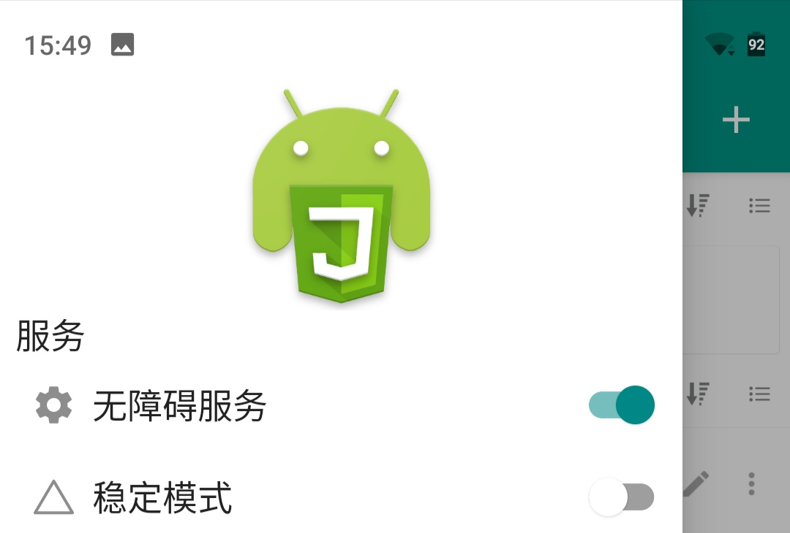
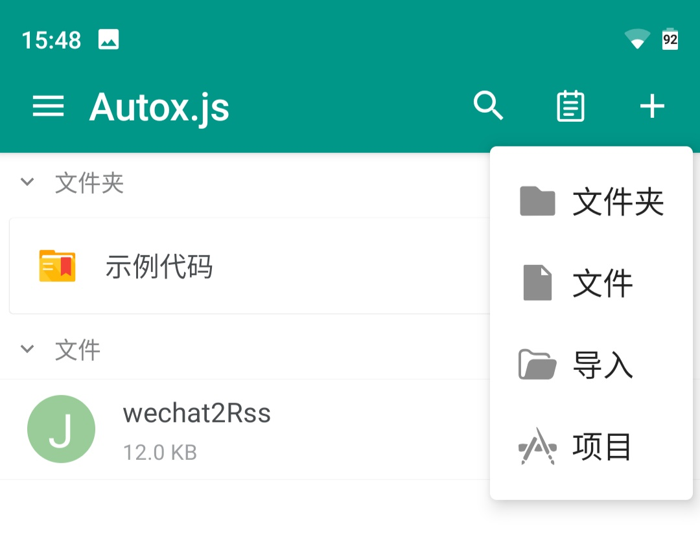
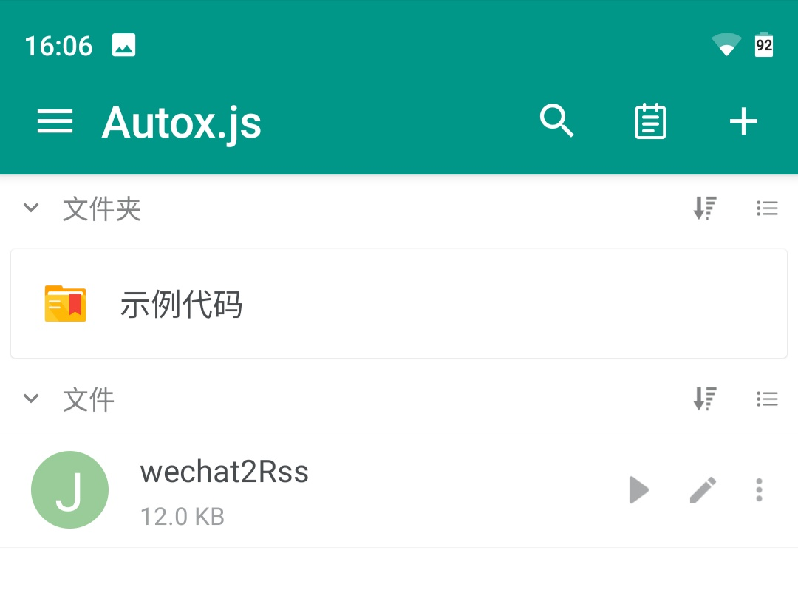
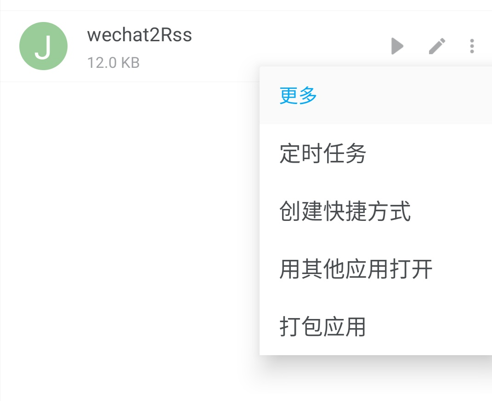
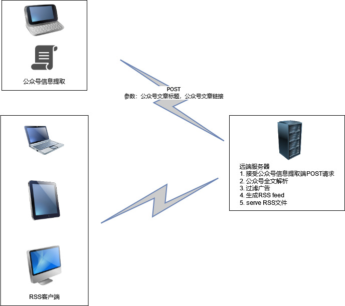

# Wechat2RssScript
> 一个自动提取微信公众号文章链接，并转化成RSS文件的自动化脚本

## 声明
* 首先感谢[Auto.js](https://github.com/clearw5/Auto.js)和[AutoX](https://github.com/kkevsekk1/AutoX)。正是由于它们提供的基础服务，才使此脚本成为可能。
* 本人非全职自由开发者，只是工作之余开发此脚本，后期维护和更新不一定及时，请见谅。
* 本人运行此脚本的平台只有一台Nokia X6的备用机，针对其他种类手机，某些运行参数可以在脚本中调整，详见[脚本参数配置](#脚本参数配置)。如果调整参数后，仍然有问题，请收集运行日志，截图和录屏，提交issue，本人将抽空跟进。请勿催促，谢谢。

## 主要功能
* 获取指定公众号文章的链接，并生成RSS的XML文件，便于RSS客户端订阅

### 功能限制
* 当前脚本只适用于安卓平台，因为安卓手机的多样性，脚本无法适配所有手机的解锁动作，因此脚本只专注于公众号文章链接提取功能。
* 由于当前[AutoX](https://github.com/kkevsekk1/AutoX)提供的库功能有限，所以当前生成的RSS文件只包含了公众号文章的链接，无法包含全文内容。全文解析功能可以参考[扩展思路](#扩展思路)。

## 安装与使用

### 准备工作
* 从[AutoX Release](https://github.com/kkevsekk1/AutoX/releases)中下载适合自己手机的AutoX APP，并安装。
* 如需要设置AutoX定时运行脚本，需要将AutoX加入允许后台运行的列表（一般在电池管理配置菜单中）
* 在AutoX中开启无障碍服务


### 脚本参数配置
可根据手机的具体情况调整一下参数

```javascript
    var interestingUps = [
        "drpei",
        "包邮区", "渤海小吏", "饭统戴老板",
        "集思录", "老和山下的小学僧", "卢克文工作室",
        "兽楼处", "睡前人间", "睡前消息编辑部", "天机奇谈", "铁头功社",
        "西西弗评论", "远川科技评论", "远川投资评论", "远川研究所"];
    var timeWaitForWakeupMobile = 1000;
    var timeBeforeBack = 1000;
    var timeWaitForBack = 2000;
    var timeWaitForClick = 3000;
    var longWait = 5000;
    var shortWait = 500;
    var onlyNewMessage = false;
    var deleteSubscriberChat = false;
    var targetXmlFilePath = "/sdcard/Wechat2Rss/Wechat2Rss.xml";
```

|  变量   | 说明  |
|  :----  | :----  |
| interestingUps  | 关注的公众号名字，用于过滤广告 |
| onlyNewMessage  | 控制是否在有新公众号文章的时候来执行实际功能 |
| deleteSubscriberChat  | 控制是否在获取链接后删除公众号标签 |
| targetXmlFilePath  | 生成RSS XML文件的目标地址 |
| timeWaitForWakeupMobile  | 等待唤醒手机的时延 |
| timeBeforeBack  | 执行返回操作前的等待时延 |
| timeWaitForBack  | 执行返回操作后的等待时延 |
| timeWaitForClick  | 执行点击操作后的等待时延 |
| longWait  | 长时延 |
| shortWait  | 短时延 |


### 脚本导入与试运行
* 点击右上角"+"按钮，点击导入，选择需要导入的脚本

* 脚本导入成功后，点击脚本行中的三角图标，试运行


### 设置定时任务
如果脚本导入并试运行成功，则可以设置定时任务


> Note: 一般设置定时任务需要解决屏幕解锁问题，或者选用一个备用机设置成无锁屏


## 扩展思路


由于AutoX现有库的限制，要在脚本中实现全文解析会比较麻烦，所以只是生成了一个包含公众号文章链接的本地XML文件，用于RSS订阅。现有脚本限制主要在两个方面：

* XML文件为手机本地文件。
* XML文件中只包含文章链接，没有全文内容。

解决思路
* 配备一个公网的云主机，用于接受来自手机的POST请求，解析全文，过滤广告，serve RSS全文文件


## 联系作者
* 程序由个人独立开发，能力有限，难免出现一些Bug，欢迎大家反馈Bug和提出优化建议
* 邮件: oxotoxo@foxmail.com
* TG group: https://t.me/+c4OjVlN3pzE0ZmJl

## 捐助作者
此程序完全免费，如果你觉得这个程序对你有所帮助，可以通过扫面下方二维码（微信）
进行捐赠，金额请随意，谢谢你的理解和支持！

